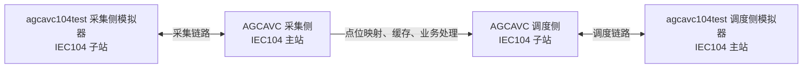
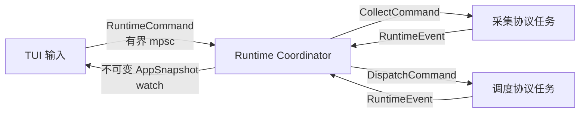

# agcavc104test 模块化事件驱动 TUI 重写设计

日期：2026-07-16

状态：实现完成；47 项自动化测试、格式检查和严格 Clippy 均通过

实现仓库：`/Volumes/QiaoFanxing/RustProjects/agcavc104test`

只读联调目标：`/Volumes/QiaoFanxing/JavaProjects/AGCAVC`

## 1. 背景

现有 `agcavc104test` 将连接、协议处理、状态、菜单和 TUI 渲染集中在单个大型 `main.rs` 中，启动时还需要选择运行角色。它已经能够发送和接收部分 IEC 60870-5-104 报文，但难以扩展，也无法用统一界面观察采集侧和调度侧之间的完整转发链路。

本次重写把程序定位为一套双端 IEC104 人工测试台：

- 下端模拟采集装置，供 AGCAVC 的采集主站连接。
- 上端模拟调度主站，主动连接 AGCAVC 的调度子站。
- 两端固定同时运行，互不连带退出。
- 所有业务动作从 TUI 手工触发或由协议请求自动驱动。
- 程序覆盖 AGCAVC 当前已经实现的全部 IEC104 入站、出站和转发能力。

本次不修改 AGCAVC，不替用户执行跨程序联调，也不交付单独的手工联调清单。AGCAVC 只作为协议行为的只读事实来源。

## 2. 目标与非目标

### 2.1 目标

1. 以模块化、事件驱动方式完全重写测试程序。
2. 启动时固定启动采集侧监听和调度侧连接任务。
3. 通过七个顶部页签操作、观察两条 IEC104 链路。
4. 完整支持 AGCAVC 当前采集侧和调度侧使用的 ASDU 类型及流程阶段。
5. 支持正常、拒绝、延迟、超时和断链等控制应答场景。
6. 点位、协议参数和默认响应行为全部由配置文件提供。
7. 使用浅色背景、深色文字和丰富的背景色区分日志语义。
8. 用自动化测试验证协议编码、状态归约、页面渲染和关键链路行为。

### 2.2 非目标

- 不修改、生成或写入 AGCAVC 仓库中的任何文件。
- 不自动启动 AGCAVC，也不代替用户执行最终跨程序联调。
- 不实现 AGCAVC 当前明确未支持的业务类型，例如成组遥信、带时标遥测和带时标电度。
- 不把测试程序扩展为通用 IEC104 协议分析器。
- 不依赖命令行参数；启动只读取配置文件。
- 不再按固定五秒周期自动改变采集点值。

## 3. 系统拓扑



测试程序内部的两个协议端独立运行，但把事件汇入同一个状态协调器。这样可以同时观察：

- 采集主动上送进入 Java 后是否形成调度变化上送。
- 调度下发控制进入 Java 后是否被正确路由到采集端，并把结果返回调度端。

## 4. AGCAVC 当前能力覆盖基线

### 4.1 测试程序采集侧接收 Java 请求

| Java 发出 | 测试程序行为 |
| --- | --- |
| `C_IC_NA_1` 总召 | 自动发送 ACTCON、配置点数据和 ACTTERM |
| `C_CI_NA_1` 电度总召 | 自动发送 ACTCON、`M_IT_NA_1` 和 ACTTERM |
| `C_CS_NA_1` 校时 | 镜像 CA、OA、时标和测试位，发送单次 ACTCON |
| `C_SC_NA_1` 单点控制 | 处理选择/执行，按策略返回同型回执 |
| `C_DC_NA_1` 双点控制 | 处理选择/执行，按策略返回同型回执 |
| `C_RC_NA_1` 升降控制 | 处理选择/执行，按策略返回同型回执 |
| `C_SE_NC_1` 短浮点遥调 | 处理选择/执行，按策略返回同型同值回执 |

总召数据包含 AGCAVC 采集解码器当前支持的全部实时数据类型：

- `M_SP_NA_1` 单点遥信。
- `M_DP_NA_1` 双点遥信。
- `M_ME_NA_1` 带品质归一化遥测。
- `M_ME_ND_1` 不带品质归一化遥测。
- `M_ME_NC_1` 短浮点遥测。

总召数据的 COT 根据请求 QOI 使用站总召或分组总召响应原因。电度总召根据 QCC 使用总请求或组 1～4 响应原因。空点表仍完成 ACTCON/ACTTERM 流程。

### 4.2 测试程序采集侧主动上送

采集指令页能够手工触发：

- 主动上送全部当前值，不改变任何点值。
- 全部点刷新并主动上送。
- 单点遥信。
- 双点遥信。
- 遥测，编码可选 `M_ME_NA_1`、`M_ME_ND_1`、`M_ME_NC_1`。
- 电度 `M_IT_NA_1`。
- 单点 SOE `M_SP_TB_1`。
- 双点 SOE `M_DP_TB_1`。
- 初始化结束 `M_EI_NA_1`。

“主动上送全部当前值”直接基于当前不可变快照组帧，不触发点值变化。“全部点刷新”是一个逻辑批次：先对所有配置点各变化一次并生成不可变快照，再按 TypeID 分组、按 ASDU 容量拆帧并连续上送。不会在不同 TypeID 发送期间再次修改值。

单独类型上送同样先刷新该类型下的全部配置点，再一次性生成发送批次。SOE 使用数字量的规范状态，不维护第二份易漂移的 SOE 值。

单点、双点、遥测和电度编码同时支持逐点编址与顺序编址。配置可选择 `individual`、`sequence` 或 `auto`：`sequence` 只把连续 IOA 合并为顺序信息体，不连续点自动开始新的信息体；`auto` 按连续区间选择更紧凑的编码。这样能够直接验证 AGCAVC 对两种编址方式和跨帧 IOA 偏移的处理。

### 4.3 测试程序调度侧发送 Java 请求

| TUI 操作 | 发出报文 |
| --- | --- |
| 全局或分组总召 | `C_IC_NA_1`，QOI 20～36 |
| 全局或分组电度总召 | `C_CI_NA_1`，可配置 QCC 请求组和冻结限定词 |
| 当前时间或指定时间校时 | `C_CS_NA_1` |
| 单点遥控 | `C_SC_NA_1` |
| 双点遥控 | `C_DC_NA_1` |
| 升降控制 | `C_RC_NA_1` |
| 归一化遥调 | `C_SE_NA_1` |
| 标度化遥调 | `C_SE_NB_1` |
| 短浮点遥调 | `C_SE_NC_1` |
| 读取兼容性探测 | `C_RD_NA_1` |

调度指令页只显示指令列表，不常驻显示高级表单或行为说明。所有指令均由鼠标单击选择；无参数链路指令立即执行，其余指令弹出与该指令相关的参数窗口，例如遥控只要求输入 IOA、值、选择位、地址和限定词。默认只发送一次，高级参数仍支持 OA、测试位、重复次数和发送间隔。配置点提供类型和值域提示，但允许向未配置 IOA 发命令，以便观察 Java 的未知点、类型不匹配和非法值拒绝行为。

总召、电度总召和校时既可使用配置的本站公共地址，也可手工选择广播公共地址 `65535`。广播请求返回后，测试程序按 AGCAVC 当前行为接受并校验其配置的具体站公共地址，而不是要求响应继续使用广播地址。

`C_RD_NA_1` 用于观察 AGCAVC 当前明确的“链路确认但不产生应用回复”行为，不把它误判为连接丢失。

### 4.4 测试程序调度侧接收 Java 响应

测试程序需要解析并展示：

- 总召提前 ACTCON。
- 总召 `M_SP_NA_1`、`M_DP_NA_1`、`M_ME_NC_1` 数据和 ACTTERM。
- 电度总召提前 ACTCON、`M_IT_NA_1` 数据和 ACTTERM。
- 校时时标镜像 ACTCON，且只接受一次确认作为正常结果。
- 单点、双点、升降、三种设点的同型同值 ACTCON、ACTTERM 和否定 ACTCON。
- Java 主动变化上送的 `M_SP_NA_1`、`M_DP_NA_1`、`M_ME_NC_1`、`M_SP_TB_1`、`M_DP_TB_1`。

总召与电度总召分别使用一次调用一个累积器：ACTCON 建立待处理轮次，数据帧写入临时快照，ACTTERM 才原子替换页面上的上一份完整快照。异常、超时或断链时丢弃临时数据并保留上一份完整结果。

同一链路同一类召唤只允许一个未完成轮次；重复触发在本地拒绝并写入告警日志。控制回执按 CA、OA、TypeID、IOA、值、选择位和测试位关联到原命令。

## 5. 控制流程和异常注入

### 5.1 正常采集应答

- 选择命令：返回同型、同值、同 SE 位的正向 ACTCON，不返回 ACTTERM，也不修改实时值。
- 执行或直接执行：先返回正向 ACTCON，再返回 ACTTERM；ACTTERM 成功发送后提交实时值变化。
- 拒绝：返回否定 ACTCON，不修改实时值。

这与 AGCAVC 的三态解码一致：ACTCON 为 `ACCEPTED`，ACTTERM 为 `COMPLETED`，否定确认为 `REJECTED`。

### 5.2 一次性响应策略

为覆盖 Java 已实现的拒绝、等待、超时和链路生命周期分支，提供全局快捷键打开“下一条采集控制响应”弹窗。它不占用新页签，也不把结果显示在采集指令页。

支持以下策略：

- 正常成功。
- 选择阶段拒绝。
- 执行阶段拒绝。
- 只发送 ACTCON，不发送 ACTTERM。
- 完全静默。
- 延迟后正常成功。
- 收到匹配命令后断开采集连接。

一次性策略包含匹配阶段，只有命中的下一条控制才消费；未命中的报文不清除策略。状态页显示当前等待中的一次性策略。未设置一次性策略时使用点位配置中的默认策略。

### 5.3 端到端控制转发

调度侧向 Java 发送前置选择时，AGCAVC 当前会在本地完成路由和值校验并返回 ACTCON，不向采集侧发送报文。调度侧发送执行命令后，Java 才根据点位关系转发给采集端。

测试程序采集侧处理转发后的：

- 单点控制。
- 双点控制。
- 升降控制。
- 短浮点设点。

上游归一化、标度化和短浮点设点均可由 Java 换算后以下游短浮点设点发送。采集侧日志记录收到的最终 IOA 和工程值，调度侧日志记录 Java 返回的原始上游编码和阶段，从而能在同一 TUI 中观察完整转换。

## 6. 连接和链路状态机

### 6.1 启动行为

程序拒绝所有命令行参数。配置校验通过后同时启动：

1. 采集侧服务端监听任务。
2. 调度侧 TCP 连接任务。
3. 状态协调器。
4. TUI 输入和渲染循环。

任意一侧失败只改变该侧状态并产生错误日志，不终止另一侧或 TUI。

### 6.2 调度侧状态

```text
DISCONNECTED
  -> CONNECTING
  -> CONNECTED_STOPPED
  -> STARTING
  -> ACTIVE
  -> STOPPING
  -> CONNECTED_STOPPED
```

- TCP 建立后固定进入 `CONNECTED_STOPPED`。
- 首次 STARTDT 必须由用户手工触发。
- 断线后可自动重建 TCP，但每个新连接仍回到 `CONNECTED_STOPPED`。
- 不跨连接保存 STARTDT 激活状态。

### 6.3 采集侧状态

```text
STOPPED
  -> LISTENING
  -> CONNECTED_STOPPED
  -> ACTIVE
  -> LISTENING
```

采集侧等待 Java 主站发出 STARTDT，并按 IEC104 U 帧语义自动确认。Java STOPDT 或断线后清理当前会话，但保留点值和日志。

### 6.4 T1、T3 与 TESTFR

进入 ACTIVE 后，由协议运行时自动维护 T3 空闲计时、发送 TESTFR，并自动确认对端 TESTFR。手工业务 ASDU 不承担保活职责。

T1 只跟踪待确认的 I 帧或 U 帧。没有手工下发业务命令本身不会导致 T1 超时；如果 TESTFR 未获确认或 I 帧长期未获 S/I 确认，才进入链路错误和重连流程。

手工 TESTFR 只作为诊断操作，结果写入调度日志。

## 7. 事件驱动架构

### 7.1 模块边界

建议拆分为：

```text
src/
  main.rs
  app/
    command.rs
    event.rs
    reducer.rs
    snapshot.rs
  config/
    model.rs
    validation.rs
  domain/
    connection.rs
    log.rs
    point.rs
    transaction.rs
  protocol/
    common.rs
    collect/
      codec.rs
      runtime.rs
      state.rs
    dispatch/
      codec.rs
      runtime.rs
      state.rs
  runtime/
    coordinator.rs
    supervisor.rs
  ui/
    input.rs
    theme.rs
    tabs.rs
    widgets/
    pages/
      status.rs
      collect_logs.rs
      dispatch_logs.rs
      collect_commands.rs
      dispatch_commands.rs
      collect_values.rs
      dispatch_values.rs
```

具体文件可以在实施时小幅调整，但必须保持配置、领域状态、协议任务、协调器和页面渲染之间的单向依赖。

### 7.2 消息流



- UI 只产生命令和渲染快照，不直接访问 socket 或可变点表。
- 协议任务独占各自连接和协议状态。
- 协调器是应用状态的唯一写入者，以 reducer 方式处理 `RuntimeEvent`。
- 所有队列有界，满队列产生结构化错误事件，禁止静默丢失。
- 关闭时先停止接收新命令，再通知两个协议任务，最后恢复终端状态。

### 7.3 核心消息

`RuntimeCommand` 至少覆盖：

- 采集类型刷新和主动上送。
- 手工修改指定采集点的值。
- 调度 STARTDT、STOPDT、TESTFR。
- 调度总召、电度总召和校时。
- 调度控制和兼容性探测。
- 设置一次性采集响应策略。
- 清空采集、调度或系统日志。
- 重新加载配置。
- 退出。

`RuntimeEvent` 至少覆盖：

- 链路状态变化。
- ASDU 收发。
- 点值变更。
- 总召轮次开始、数据、完成和失败。
- 控制阶段确认、拒绝、完成和超时。
- 配置重载结果。
- 可恢复错误和致命启动错误。

`AppSnapshot` 至少包含：

- 两侧连接快照。
- 两侧结构化环形日志。
- 采集规范点值。
- 调度遥信/遥测与电度当前值。
- 调度总召和电度总召完整快照。
- 未完成事务。
- 当前一次性响应策略。
- UI 选择和参数弹窗状态中需要跨帧保存的部分。

## 8. 七页 TUI

| 页签 | 内容 |
| --- | --- |
| 1. 连接状态 | 两侧 TCP、STARTDT、T1/T3、最后收发时间、队列、总召事务和一次性响应策略状态 |
| 2. 采集日志 | 左侧接收、右侧发送；支持清屏、过滤、滚动及单击报文展开详情 |
| 3. 调度日志 | 调度链路收发及事务日志；支持清屏并保持与采集日志相同的视觉语义 |
| 4. 采集指令 | 只显示各类主动上送触发器，单击立即执行，不显示执行结果 |
| 5. 调度指令 | 只显示链路、召唤、校时、控制和探测指令；单击后按需弹出参数窗口 |
| 6. 采集实时值 | 实时显示采集领域点当前值；支持鼠标滚轮浏览，单击指定点后可手工输入并修改其值 |
| 7. 调度实时值 | 分区实时显示 Java 总召数据和主动变化上送形成的调度当前值；鼠标所在分区独立滚动 |

页面通过注册表声明标题、快捷键和渲染函数，新增页签时不修改主事件循环。

顶部页签、指令、日志行、日志清屏和采集点值编辑统一使用鼠标左键单击。指令成功交给运行时后，所属日志页立即写入醒目的全宽分隔条，使本次手工下发与前后自动报文明显分组。

采集指令结果全部进入采集日志；调度指令结果全部进入调度日志。Java 的调度主动变化上送同时逐点合并到第七页当前值；完整总召快照仍单独保存，仅在匹配 ACTTERM 后原子提交。

## 9. 浅色视觉主题和日志背景

全局禁止深色背景，默认使用象牙白或浅灰白背景及深灰文字。颜色语义如下：

| 语义 | 背景色 |
| --- | --- |
| 接收 | 浅青 |
| 发送 | 浅橙 |
| 主动上送/广播 | 浅紫 |
| 成功/完成 | 浅绿 |
| 警告/等待 | 浅黄 |
| 错误/拒绝/超时 | 浅红 |
| 普通状态 | 象牙白或浅灰 |

日志条目本身整行染色，而不是只改变前缀文字。选中行使用更明显但仍为浅色的边框或反色层，不能退化成黑底高亮。

`LogEntry` 使用结构化字段：时间、侧别、方向、级别、类别、摘要、TypeID、COT、CA、OA、IOA、原始值和可选详情。界面不得通过解析日志字符串恢复协议语义。

## 10. 配置设计

### 10.1 主配置

`config/agcavc104test.toml` 保存：

- `[protocol]`：T0、T1、T2、T3、K、W。
- `[collect]`：监听地址、端口、公共地址。
- `[dispatch]`：目标地址、端口、公共地址、TCP 重连间隔。
- `[ui]`：刷新周期、日志容量、命令和事件队列容量。
- 点位文件路径和配置热重载选项。

启动时验证：

- 端口、公共地址、IOA 和 OA 范围合法。
- `T2 < T1 < T3`。
- K、W 为正且 W 不大于 K。
- 队列和日志容量为正。
- 同一文件内 `(TypeID, IOA)` 不重复。
- 初值、变化步长和控制值满足对应类型范围。

CLI 出现任何参数都直接输出错误并退出。

### 10.2 采集点配置

`config/collect-points.toml` 保存：

- 点名、IOA、类型和总召组。
- 初值、最小值、最大值和每次变化步长。
- 品质、电度序号及标志。
- 数字量是否同时允许生成 SOE。
- 逐点、顺序或自动编址方式。
- 是否允许作为单点、双点、升降或短浮点控制目标。
- 默认控制响应策略和延迟。

数字量采用切换或明确的状态序列变化；模拟量在范围内按步长循环；电度按增量累加并维护序号。UI 手工修改只提交 IOA 和输入值，具体类型、整数约束和值域仍由采集领域点统一校验。

### 10.3 调度点配置

`config/dispatch-points.toml` 保存：

- 预期总召和电度点的 IOA、名称和类型。
- 用于指令参数弹窗提示的点类型和值域。
- 可选的默认命令类型和值。

第七页先列出配置中的预期 IOA，未收到时显示 `—`。Java 返回未配置 IOA 时动态追加并用浅黄色标记，但不丢弃数据。`M_SP_TB_1`/`M_DP_TB_1` 按相同 IOA 更新对应普通遥信当前值，不产生重复 SOE 行。

### 10.4 配置重载

全局重载命令先解析和完整校验新配置，再一次性替换可热更新部分。协议地址、端口和计时器发生变化时明确提示需要重启；点位和值域可在没有冲突事务时原子重载。校验失败保留旧配置并写错误日志。

## 11. 数据一致性

- 采集点表是采集模拟值的唯一真相来源。
- SOE 引用数字量当前状态，不复制一份独立状态。
- 控制执行只有在回执流程成功完成后才提交值变化。
- 主动上送只在采集链路 ACTIVE 时刷新并发送；未激活时本地拒绝，因此不会出现“界面已变、报文未发”的假状态。
- 总召临时数据在 ACTTERM 前不进入调度完整快照。
- 配置重载、控制提交和主动上送快照均由协调器串行归约。

## 12. 错误处理和可观察性

- 两侧任务分别监督，支持独立重连。
- socket、编解码、配置、队列、事务超时均转为结构化日志。
- 未支持 ASDU 记录限流警告，不导致进程退出。
- 错误行展示 TypeID、COT、CA、IOA 和简短原因。
- 日志使用固定容量环形缓冲，防止长期运行无限增长。
- 日志页提供清屏操作；每次手工下发后插入高可见度分隔条。
- 状态页显示最近错误，但完整过程仍保留在对应日志页。
- TUI 退出或 panic 时必须恢复终端 raw mode、alternate screen 和光标。

## 13. 自动化验证策略

本项目按需求直接实现，并使用自动化回归验证协议、状态和渲染；不编写单独的人工联调清单，也不做鼠标协议注入模拟测试。

### 13.1 单元测试

- 主配置和两个点位配置的成功、边界和失败校验。
- 各点类型的单次变化、范围循环、电度累加及 SOE 共用状态。
- RuntimeCommand/RuntimeEvent reducer 和不可变快照。
- 一次性响应策略的阶段匹配和只消费一次语义。
- 总召累积器的 ACTTERM 原子提交与失败保留旧快照。
- 结构化日志分类和浅色主题映射。

### 13.2 协议测试

- 采集侧所有主动数据类型的编码和拆帧。
- 逐点编址、顺序编址、连续区间切分和跨帧 IOA 计算。
- 总召、电度总召、校时的完整响应顺序与镜像字段。
- 单点、双点、升降、短浮点控制的选择、执行、拒绝和超时策略。
- 调度侧全局/分组总召和电度总召。
- 调度侧本站地址与广播地址请求，以及广播请求返回具体站地址。
- 三种设点、两种遥控和升降命令的发送及同型回执关联。
- 调度主动变化五种 TypeID 的接收。
- 调度主动变化、SOE 与总召数据对当前值的实时合并，并与完整总召快照隔离。
- `C_RD_NA_1` 无应用回复时链路仍保持正常。
- STARTDT、STOPDT、自动 TESTFR 保活和重连后停止状态。

### 13.3 TUI 测试

使用 Ratatui `TestBackend` 验证：

- 七个页签均可渲染和切换。
- 浅色背景覆盖页面、表格和日志行。
- 采集指令页不出现结果区域。
- 调度参数弹窗能编辑与所选指令相关的参数并显示验证错误。
- 采集值编辑弹窗遵守点类型和值域校验。
- 采集值和调度值页明确标记实时刷新。
- 采集值支持有界滚动；调度遥信/遥测与电度分区独立滚动；滚动后的采集点点击映射到屏幕实际行。
- 小终端尺寸下不 panic，并显示最小尺寸提示。

### 13.4 完成前命令

至少执行：

```text
cargo fmt --check
cargo clippy --all-targets --all-features -- -D warnings
RUSTC_WRAPPER= cargo test --locked
```

若测试程序提供本地回环启动模式，只能用于自动化测试，不重新引入面向用户的运行角色选择。

## 14. 验收标准

实现完成必须同时满足：

1. 无命令行参数即可从配置启动两侧任务和七页 TUI。
2. AGCAVC 当前所有采集出站消息都能由测试程序正确响应。
3. AGCAVC 当前所有采集入站数据和控制回执都能由测试程序生成。
4. AGCAVC 当前所有调度入站请求都能由测试程序手工发送。
5. AGCAVC 当前所有调度出站响应和变化上送都能由测试程序解析。
6. 调度控制经 Java 转发至采集侧时，两端日志能同时观察完整阶段。
7. 全量刷新只在手工触发时执行，并对所有配置点各变化一次。
8. T3/TESTFR 自动保活；没有业务报文时不会因为“未手工下发命令”而错误触发 T1。
9. 点位信息完全来自配置文件，未配置 IOA 仍可用于调度异常测试。
10. 页面和日志均不出现深色背景。
11. 两侧任一连接失败不终止另一侧或 TUI。
12. 格式、静态检查和自动化测试全部通过。
13. 第六页随采集点变化刷新，第七页随 Java 总召数据和主动变化上送逐点刷新，且两页均可通过鼠标滚轮查看超出可视区的点位。
